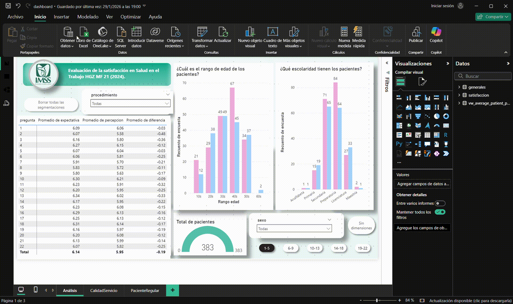
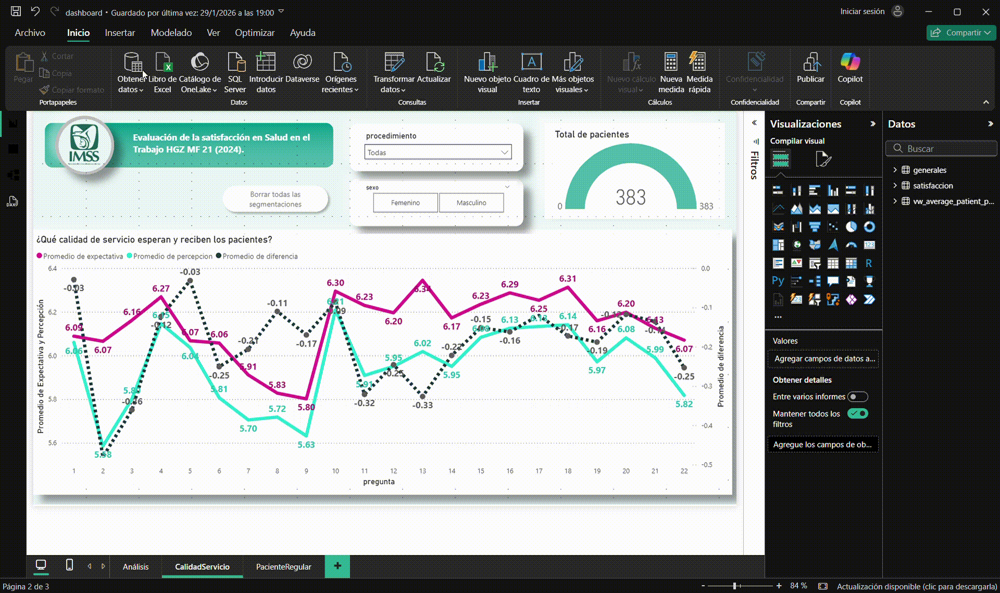
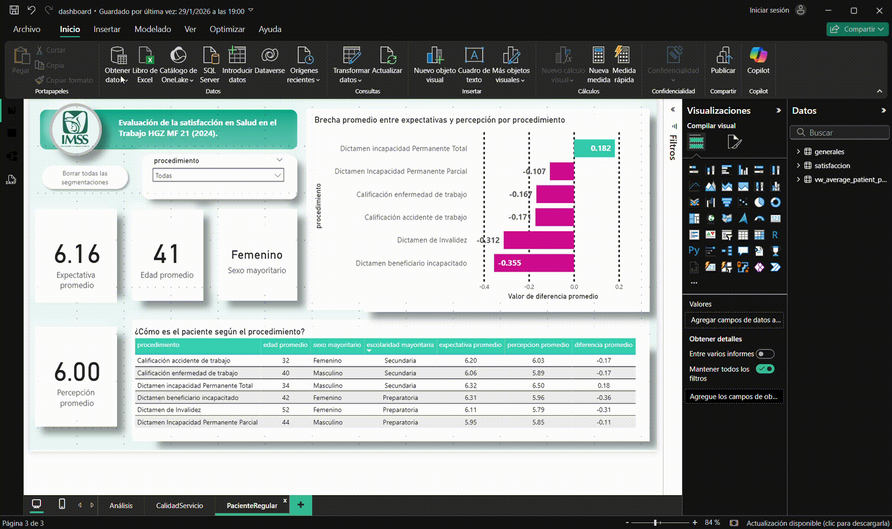
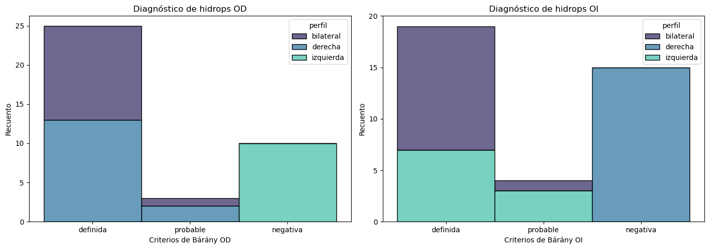
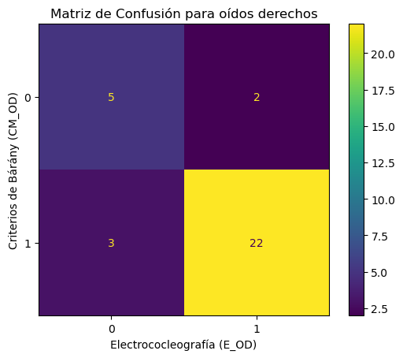
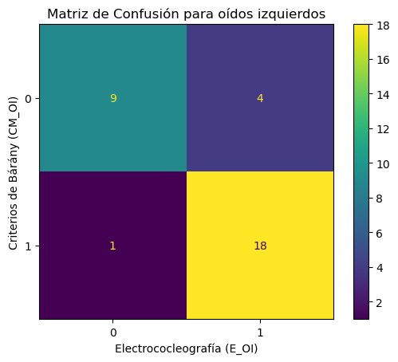
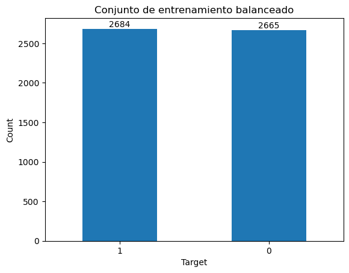
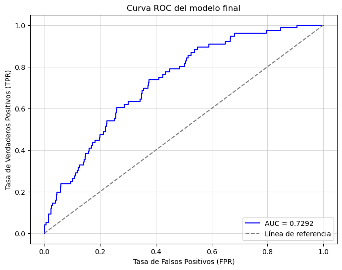
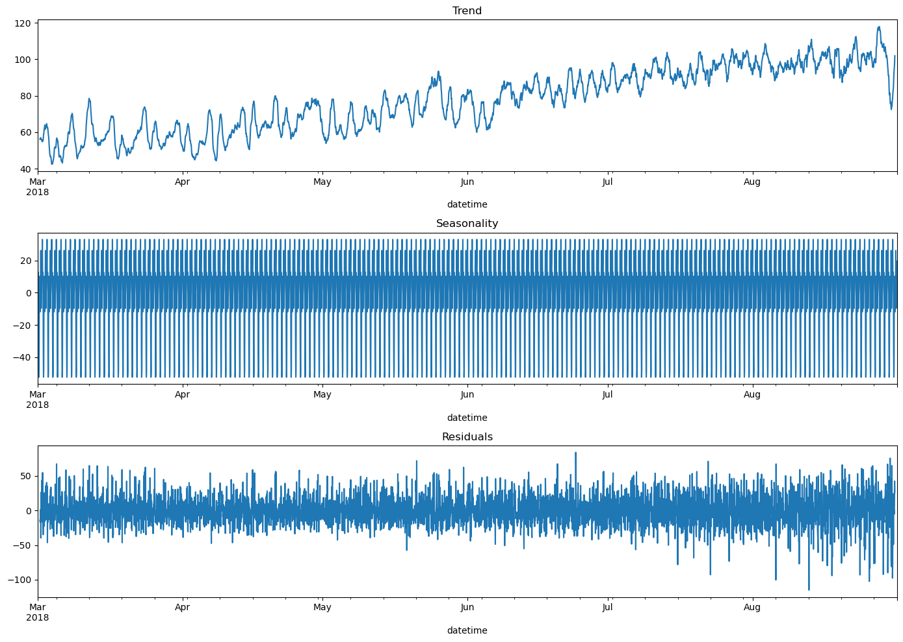
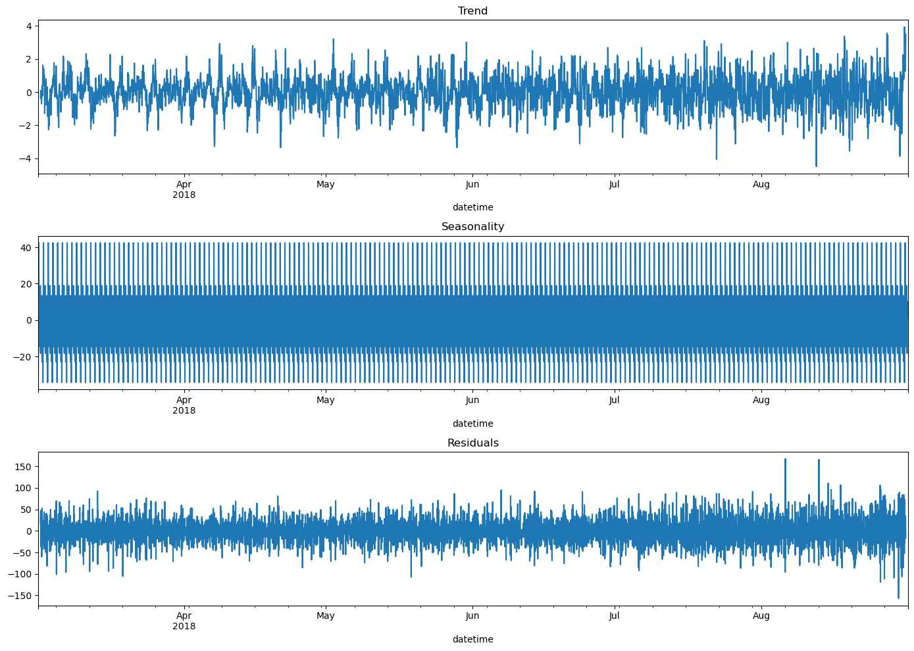

# Acerca de mí

Químico Farmacéutico Biólogo, con maestría en Síntesis Total certificado en Ciencia de Datos con sólida experiencia en limipieza de datos, ingeniería de características, construcción de modelos de aprendizaje automático y su optimización.

Doy certeza en la toma de decisiones estratégicas y ahorro tiempo mediante la automatización usando modelos de aprendizaje automático y pruebas de hipótesis que realizan predicciones confiables.


## Hard Skills
- Generación de modelos predictivos usando __Scikit-learn, PyTorch, TensorFlow__
- Optimización de modelos de __Machine Learning__ con __CatBoost, Optuna, LigthGBM__ y __GridSearchCV__
- Visualización de datos con herramientas como __Seaborn, Matplotlib, PowerBI, Chemdraw__ y __MestreNova__
- Bases de datos: __Excel__, __SQL__, __PostgreSQL__, __SQL Server__, __MySQL__ y __PySpark__.


## Soft Skills
| Pensamiento crítico | Gestión de proyectos | Optimización de procesos | Investigación aplicada | Comunicación efectiva | Adaptabilidad | Análisis de datos |


## Contáctame
[](https://www.linkedin.com/in/juanluisalvaretana/)
[](mailto:juanluisalva60@gmail.com)

# Índice
- [Proyectos de análisis de datos](#Proyectos-de-análisis-de-datos)
    - [Análisis de la calidad del servicio médico](#Análisis-de-la-calidad-del-servicio-médico)
    - [Comparación de metodologías diagnósticas para la enfermedad de hidrops](#Comparación-de-metodologías-diagnósticas-para-la-enfermedad-de-hidrops) 
- [Proyectos de ciencia de datos](#Proyectos-de-ciencia-de-datos)
    - [Retención de clientes](#Retención-de-clientes)
    - [Predicción de la demanda de una app de transporte](#Predicción-de-la-demanda-de-una-app-de-transporte)

# Proyectos de análisis de datos

## Análisis de la calidad del servicio médico
El servicio de medicina del trabajo del Hospital General de Zona de Medicina Familiar 21 del Instituto Mexicano del Seguro Social (IMSS), buscó evaluar la calidad del servicio que sus pacientes recibían al aplicarles alguno de los siguientes procedimientos:

- Calificación accidente de trabajo  
- Dictamen Incapacidad Permanente Parcial
- Dictamen de Invalidez
- Calificación enfermedad de trabajo
- Dictamen beneficiario incapacitado
- Dictamen de invalidez
- Dictamen incapacidad Permanente Total

Se tuvo interes en comparar las expectativas y percepciones de la atención médica.

### Herramientas y habilidades utilizadas
Excel, Python, SQL, PostgreSQL, Power BI, Pandas, Jupyter Notebook.

### Requerimientos para el éxito
1. Diseñar y crear un dashboard interactivo que muestre:


    - Información general de los pacientes del servicio de medicina del trabajo utilizando slicers para visualizar las difrencias en la atención por procedimiento. 
    - Comparación entre las expectativas y percepciones del servicio médico recibido.

2. Crear una base de datos relacional que alimente al dashboard en el futuro.

### Preguntas clave
* Análisis demográfico:<br>
    ¿Qué escolaridad tienen los pacientes que reciben a cada procedimiento?<br>
	   ¿Qué edad tienen los pacientes reciben cada procedimiento?<br>
	   ¿Cual es el procedimiento más solicitado?<br>
    ¿Cual es el procedimiento menos solicitado?<br>
	   ¿Cuantos pacientes se presentaron por procedimiento?<br>

* Calidad del servicio:<br>

	¿Es mayor la expectativa o la percepción de satisfacción del servicio recibido?<br>
	¿Qué preguntas mostraron la mayor diferencia negativa entre percpeción y expectativa?<br>
	¿Qué preguntas mostraron la mayor diferencia positiva entre percepción y expectativa?<br>
 ¿Cómo cambia la expectativa y percepción de cada procedimiento recibido según el sexo del paciente?

* Paciente regular:<br>

	¿Cómo es el paciente típico de cada procedimiento?<br>

### Metodología
El personal médico aplicó encuestas a 383 pacientes que constaron de 22 preguntas. Cada paciente respondió dos encuestas una previa a la atención médica y la segunda después de haber recibido la atención médica. Todas las encuestas fueron llenadas en el lugar físico después de obtener el consentimiento informado de los pacientes participantes, a los cuales se les explico el alcance del estudio. Una vez recolectados los datos el área médica cargo dichos datos en un archivo tipo .csv.

* Estructura de las encuestas

Cada encuesta constaba de:

- Encabezado: Segmento dedicado a recabar información general del paciente tal como edad, nombre, sexo, escolaridad y procedimiento solicitado.

- Cuerpo: Segmento que contaba con 22 preguntas dedicadas a evaluar la satisfacción, tiempo dedicado y expectativas de los pacientes.

* Confidencialidad

Por razones de confidencialidad de los pacientes las preguntas no se muestran y los datos originales fueron modificados para no incluir información personal sensible que pueda ser ligado a los paciente en particular con fines de proteger sus datos personales.

* Etapas

1. Diseño
2. Desarrollo
3. Prueba
4. Análisis

* Flujo de trabajo <br>


### Recomendaciones
* Se recomienda comenzar a atender las áreas de oportunidad relacionadas con las preguntas 22, 9 y 8. Lo anterior debido a que todas estas pregntas fueron identificadas tanto como preguntas con mayor diferencia tanto negativa como positva y como preguntas con la mayor diferencia negativa en el procedimiento más solicitado, así se pudo inferir que la mayoria de las insatisfacciones sólo se presentaron en casos muy puntuales de la población, por lo cual, al ser pocos casos serian más sencillos de atender, además de que solicionarlos no sólo incrementaría la percepción del servico sino que tambien reduciría de forma considerable la insatisfacción general con la atención médica al resolver 3 de 5 áreas de oportunidad que tuvieron la mayor diferencia negativa, rebalanceando la satisfacción general de los pacientes con el servicio médico.
* A mediano plazo se recomienda trabajar en las áreas de mejora de las preguntas 2, 12 y 7 abarcando así la totalidad de las áreas de mejora prioritarias identificadas garantizando un incremento en la satisfacción versus insatisfacción general.
* A consideración del personal médico, para facilitar el análisis posterior se recomienda recabar más datos del procediiento menos representados _Dictamen incapcidad Permanente Total_ o en su defecto consolidarlo en un sólo grupo que incluya también _Dictamen incapcidad Permanente Parcial_.

### Visualizaciones interesantes
* ¿Cuantos pacientes se presentaron por procedimiento?<br>

| Procedimiento | Número de pacientes |
| --- | --- |
| Calificación accidente de trabajo | 204 |
| Dictamen Incapacidad Permanente Parcial | 51 |
| Dictamen de Invalidez | 56 |
| Calificación enfermedad de trabajo | 46|
| Dictamen beneficiario incapacitado | 25 |
| Dictamen Incapacidad Permanente Total | 1 |

La visualización gráfica de la tabla anterior se puede apreciar en la visualización dinámica de Power BI con segmentadores por procedimiento. Noté como los valores del contador en verde señala exactamente la cuentra de la tabla anterior según el procedimiento analizado y como además se desglosa la cantidad de hombres y mujeres, su rango de edad y escolaridad al relacionar todas las variables en Power BI creando profundidad de análisis y sin sacrificar velocidad:


	
* ¿Cómo es la distribución de cada sexo en los pacientes encuestados?<br>

De los 383 pacientes analizados 181 fueron hombres y 200 fueron mujeres. Al analizar la distribución de ambos sexos por procedimiento se observó que:

La distribución de pacientes por procedimiento es muy desigual, siendo el procedimiento Calificación accidente de trabajo el más solicitado con diferencia entre los encuestados abarcando más de la mitad de los casos totales de encuestados. Por otra parte el  Dictamen por incapacidad Permanente Total fue el menos solicitado con sólo un caso entre los encuestados.
La distribución entre hombres y mujeres por procedimiento fue muy variada encontrado que procedimientos como Calificacción accidente de trabajo y Dictamen de invalidez la proporción fue equilibrada con distribuciones para cada sexo en el rango entre 40% - 60%, para el resto de procedimientos las proporciones entre ambos sexos fue marcadamente desigual.

Visualización del dashboard para mujeres según el procedimiento recibido:<br>


Visualización del dashboard para hombres según el procedimiento recibido:<br>
	


* ¿Qué relación hay entre la expectativa o la percepción de satisfacción del servicio recibido y que preguntas mostraron la mayor diferencia entre percepción y expectativa?<br>

De forma general la expectativa negativa del servicio es en todos los procedimientos superior a la satisfacción recibida.
En orden descendente de valor de diferencia se obtuvieron las preguntas 9 > 15 > 7 > 22 > 8. Lo anterior indicó que los puntos evaluados por estas preguntas son las mayores fortalezas del servicio actual médico actual. En orden ascendente de diferencia obtenida las preguntas fueron: 2 > 22 > 9 > 8 > 7. Las preguntas anteriores indican los puntos de mejora más urgentes a tratar para el servicio médico de medicina en el trabajo ya que un valor de diferencia negativa promedio indica una mayor valor de expectativa con respecto a la percepción del servicio médico recibido. 
El procedimiento más solicitado fue la Calificación accidente de trabajo con el 53.26% de los casos. Al analizar las preguntas con mayor diferencia negativa de dichos pacientes se observó que las preguntas con mayor grado de insatisfacción en orden ascendente fueron: 9 < 22 < 8 < 2 < 12. Como era de esperarse al abarcar la mayoría de los casos la mayoría de las preguntas coincidieron con aquellas que se mostraron al analizar las preguntas que tuvieron la mayor diferencia negativa de forma global siendo coincidentes las preguntas: 22, 9, 8 corroborando el caraceter prioritario por atender dichos aspectos de mejora. Por otro lado las preguntas 12 y 2 podrían ser atractiva de tratar a mediano plazo porque su mejora afectaría positivamente en la percepción de más del 50% de los pacientes.



* ¿Cómo es el paciente típico que acude a cada procedimiento?<br>

La siguiente visualización en el dashboard dinámico de Power BI muestra como los datos demográficos (tales como la edad promedio y sexo más frecuente) y los valores de expectativa promedio y percepción promedio del servicio médico cambia según el procedimiento analizado, debido a que existieron cambios en las poblaciones de cada procedimiento.



<br>
<br>
<br>

## Comparación de metodologías diagnósticas para la enfermedad de hidrops

Proyecto enfocado a conocer si existen diferencias estadísticamete significativas entre el uso de criterios médicos de Bárány y la electrococleografía estratimpánica para diagnosticar hidrops endolinfático en un grupo de 38 pacientes de la UMAE HE 1, considerando ambos oidos en cada paciente.

### Planteamiento de Hipótesis
- Hipótesis nula:
No hay diferencia estadísticamente significativa entre los resultados de clasificación diagnóstica de la electrococleografía extratimpánica y los criterios clínicos de la Sociedad Bárány en pacientes adultos atendidos en el servicio de audiología de la UMAE HE 1.

- Hipótesis alternativa:
Hay una diferencia estadísticamente significativa entre los resultados de clasificación diagnóstica de la electrococleografía extratimpánica y los criterios clínicos de la Sociedad Bárány en pacientes adultos atendidos en el servicio de audiología de la UMAE HE 1.

### Herramientas y habilidades utilizadas
Excel, Python, Pandas, Numpy, Statsmodels, Jupyter Notebook, Seaborn, Matplotlib, estadística inferencial.

### Requerimientos para el éxito
1. Demostrar estadísticamente si los métodos de diagnóstico mediante los critierios de Bárany y la electrococleografía son equivalentes o no.
2. Calcular la especificidad y sensibilidad del diagnóstico utilizando la electrococleografía.

### Preguntas clave
¿Son equivalentes los diagnósticos obtenidos mediante los criterios de Bárany por entrevista médica y la electrococleografía para diagnosticar hidrops endolinfático sin importar la severidad de la enfermedad?
¿Qué proporción de los diagnósticos son definidos y cuales probables?
¿Cuál es la sensibilidad (recall) y especificidad de la electrococleografía en comparación con los criterios de Bárany?

### Metodología
A partir de un archivo .csv se obtuvieron los datos originales los cuales fueron limpiados y estructurados para el análisis utilizando Python y librerias especializadas como Pandas. Posteriormente se trabajo en encontrar relaciones entre variables y se presentaron visualizaciones iniciales de los datos usando Matplotlib y Seaborn. Mediante ingeniería de características se enriquecieron los datos iniciales y se agregaron características de cara a realizar la prueba de hipótesisi de Mc Nemar para cada oído en cada caso clínico. Los resultados de la prueba estadística junto con los resultados de la sensibilidad y especificidad fueron interpretados para realizar una conclusión final de si existe o no equivalencia estadística entre métodos diagnósticos.

### Recomendaciones
Los resultados sugieren que no existen diferencias estadísticamente significativas entre la electrococleografía y los criterios clínicos de Bárány en la clasificación diagnóstica del hidrops endolinfático, tanto en oído derecho como izquierdo, dentro del grupo de pacientes analizado. Esto significa equivalencia diagnóstica, decisión que apoyo en la compra de un equipo especializado en este tipo de análisis en el árae de audiología.

### Visualizaciones interesantes
* ¿Cómo son los diagnósticos con los criterios de Bárany en cada uno de los oídos de los pacientes estudiados?



Los histogrmas mostraron:<br>

a) Para ambos oídos los resultados de diagnóticos más frecuentes mediante los criterios de Bárány fueron los definidos.<br>
b) Para ambos ídos los resultados de diagnóstico menos frecuentes mediante los criterios de Bárány fueron los probables.<br>
c) La segunda respuesta más frecuente en ambos oídos fue para los casos negativos de diagnóstico mediante los criterios de Bárány.<br>
d) Cuando se analizan los perfiles auditivos y los resultados definidos del diagnótico mediante los criterios de Bárány se observa que para los oídos derechos la proporción de los diagnósticos bilaterales es ligeramente inferior a la cantidad de los identificadas sólo en el oído derecho pero dicho patrón se invierte al analizar los resultados de los oídos izquierdos ya que en la cantidad de los diagnósticos definidos que fueron también bilaterales fueron mayores que los definidos unicamente sobre el oído izquierdo. Cabe resaltar que aunque se observá un patrón opuesta la diferencia en las proporciones de las frecuencias son pequeñas y aproximadamente llegan a la mitad de los casos para ambos oídos.<br>
e) Los perfiles bilaterales que también fueron diagnósticados como probables mediante los criterios de Bárány fueron marcademente menores que los identificados como probables en un sólo oído. Dicha proporción se encontro entre 1:3.<br>

* ¿Qué tan confiable es la electrococleografía al diagnosticar la enfermedad en comparación al método tradicional en cada uno de los oídos análizados?

Para responder la pregunta se cálculo la especificidad, la sensibilidad y se realizó la prueba de hipóteissi de Mc Nemar para cada caso clínico, por lo que al analizar los oídos de forma independiente se obtuvieron los siguientes resultados:

a) Para oídos derechos:<br>

Sensibilidad (Recall): 0.88 <br>
Especificidad: 0.71 <br>
``` python
result_od = mcnemar(matrix_od, exact=True)
print('p valor:', result_od.pvalue)
p valor: 1.0
```
Se obtuvo un valor p = 1.0, lo que indica que no existe evidencia estadísticamente significativa para rechazar la hipótesis nula. Esto sugiere que, en este grupo, ambos métodos clasifican de forma similar a los pacientes respecto al diagnóstico del hidrops endolinfático en el oído derecho.




b) Para oídos izquierdos:<br>

Sensibilidad (Recall): 0.95<br>
Especificidad: 0.69<br>

``` python
result_oi = mcnemar(matrix_oi, exact=True)
print('p valor:', result_oi.pvalue)
p valor: 0.375
```
El valor p = 0.375 también está por encima del umbral común de significancia (α = 0.05), por lo que tampoco se rechaza la hipótesis nula. En este caso, no se encontró una diferencia significativa entre los métodos en la clasificación diagnóstica del oído izquierdo.



<br>
<br>
<br>

# Proyectos de ciencia de datos

## Retención de clientes

Según un estudio de Harvard Business School, el coste de adquisición de un nuevo cliente es de 5 a 7 veces mayor que el coste de retener un cliente existente. Con la finalidad de __reducir costos__ desarrollé un modelo predictivo que permitió identificar a los clientes que cancelarian su servicio con Telecom, permitiendo desarrollar __estrategias promocionales focalizadas__ aumentando la __fidelización efectiva__.

### Herramientas y habilidades utilizadas


[]()
[]()
[]()
[]()


### Requerimiento para el éxito:

El modelo debe de ser capaz de predecir con un AUC-ROC superior a 0.65.

### Preguntas clave


1. ¿Qué factores podrían afectar la cancelación del servicio?
2. ¿Qué ventana de temporal debería de utilizarse para realizar la predicción?
3. ¿Cómo se pueden segmentar los clientes para entrenar efectivamente un modelo de aprendizaje automático?


### Metodología


__Importación de datos__: Se importaron los datos a partir de varios archivos .csv de Telecom con diferentes datos a analizar.

__Exploratory Data Analysis (EDA)__: Se identificó la variable objetivo y las características de cara a un problema de clasificación desbalanceada en una población con tres tipos de duración de contrato que pueden
abarcar los servicios de telefonia y/o internet y se definé un horizonte de predicción de 6 años con base en los datos presentados por el cliente. Se consolida la información necesaria en un solo dataset, y se 
homogenizaron formatos, gestionando valores ausentes y corroborando la no duplicación de valores explícitos.

__Preprocesamiento__: Se realizó feature engineering al crear y eliminar columnas, codificación de columnas categóricas utilizando One-Hot Encoding y Codificación de etiquetas, escalamiento, segmentación de datos
y el usó de upsampling.

__Modelos__: Se entrenaron modelos de regresión logística y tipo bosque aleatorio de clasificación, probando métodologías con y sin validación cruzada, con y sin optimización bayesiana de hiperparámetros, y con y 
sin boosting.

__Modelo Final__: El modelo final predijo correctamente el 72% de los casos de prueba superando el requerimiento de cliente.


### Recomendaciones

__Focalizar esfuerzos__: Exiten dos tipos de clientes, sin embargo aquellos que contratan servicios de telefonia e internet aportan la mayor parte del ingreso independientemente del tipo de contrato.

__Facilitar la transición de contratos__: Los clientes fieles en su mayoría comienzan con un contrato mensual, que eventualmente cambian a uno anual y finalmente a una bianual. Facilitar la transición entre  
un tipo de contrato y otro podría aumentar la fidelización.


### Visualizaciones interesantes


#### 1. ¿Cómo son los clientes?


Los clientes constan de dos poblaciones que se separa en un valor de gasto cercano a 40, siendo menor a dicho valor si sólo se contrata uno de los dos servicios disponibles comportamiento apreciado al analizar los cargos totales contra la fecha de incio del contrato. Por otra parte, la distribución de los valores de End_Date, 0 y 1, se observa en ambas poblaciones y en cada relación de variables representada por lo que es poco probable que estos factores mantengan una relación determinante por si mismos para predecir la cancelació o no del servicio.


#### 2. ¿Cómo influye la ventana contractual en los clientes?


Observamos que la mayoría de los clientes actualmente tiene contratos mensuales, sin embargo existe una migración a contratos de mayor duración en los clientes leales. Por otra parte, la mayor parte de los cargos totales se deben a contratos bianuales.


#### 3. Desbalanceo de clases


Los datos iniciales tenían un marcado desbalanceo con una aproximación 10:1.


Dicho desbalanceo se trató con upsampling logrando balancear las clases. Acontinuación se muestra el conjunto de entrenamiento balanceado.




#### 4. Curva AUC-ROC


El modelo final permitió realizar predicciones correctas el 72% de las ocasiones superando el requerimiento del cliente.




Explora a detalle en el repositorio: 


[](https://github.com/ja19191990/Telecom-Report)


## Predicción de la demanda de una app de transporte 


Previniendo fluctuaciones en la demanda de transporte en áreas adyacentes a aeropuertos, se logró asignar recursos operativos y captar suficientes conductores para cubrir eficientemente el volumen de solicitudes durante los períodos de mayor actividad.


### Herramientas utilizadas


[]()
[]()
[]()
[]()


### Requerimientos para el éxito:

La métrica RECM en el conjunto de prueba no debía superar a 48 en un horizonte de una hora.


### Preguntas clave


1. ¿Cómo gestionar los datos atípicos?
2. ¿Se cuenta con una serie temporal estacionaria?
3. ¿Qué modelo puede ser útil para predecir la demanda?

### Metodología


__Importación de datos__: Se importaron los datos a partir de un archivos .csv de Sweer Lift Taxi con 26496 filas y variables tipo _object_ e _intiger_ en los datos y con una asignación de tipo de variable
incorrecta en la columna _datetime_.

__Exploratory Data Analysis (EDA)__: Se modificó el tipo de variable contenida en la columna datetime de acuerdo a la documentación para abordar la construcción de un modelo predictivo para serie temporales. 

__Preprocesamiento__: Se gestionaron outliners mediante una función propia para identificar a los datos que seguian un patrón general y cuales no. Se utilizó el remuestreo redifiniendo la ventana temporal a 
analizar. Usando una media móvil se transformó la serie temporal a una estacionaria apta para entrenar el modelo.

__Modelos__: Se entrenaron modelos de regresión lineal y Bosque aleatorio de regresión utilizando GridSearchCV y Optuna para el _tunning_ de hiperparámetros y CatBoost como herramienta de boosting.

__Modelo Final__: El RMSE del modelo de bosque aleatorio con el conjunto de datos de prueba fue de 35.65 al predecir el número de ordenes de servicio de taxi  en un escenario con horizonte de una hora siendo 
menor al umbral solicitado de 48.


### Recomendaciones


__Gestión eficiente de la demanda__: Los datos mostraron que la demanda habital de ordenes de servicio oscila entre más menos 20 ordenes, de una hora a otra permitiendo reservar el número de conductores necesarios
para cubrir las horas pico de servicio. 

__Gestión eficiente de los recursos__: Las predicciones de la demanda permiten ajustar las tarifas de forma dinámica hora a hora para regular la disponibilidad de conductores de taxi maximizando la rentabilidad.


### Visualizaciones interesantes

#### 1. ¿Cuántos datos siguen un patrón general?

Se creó una función que identificó y eliminó los outliners númericos que exceden el intervalo que va desde Q1-(IQR*1.5) a Q3 +(IQR*1.5).Siendo IQR el espacio intercuartílico, Q1 el percentil 25% y Q3 el percentil
75%. Después de aplicar la función detect_outliner se observó:

* La media cambió de 14.070 a 13.279.
* La desviación estándar cambió de 9.211 a 7.763.
* El valor mínimo se mantuvo en 0.000.
* El valor máximo cambió de 119 a 35.


#### 2. ¿Qué tendencia y estacionalidad tienen los datos originales?

Se observo una tendencia principalmente ascendente en el número de ordenes de taxis conforme transcurren los meses del año oscilando aproximadamente entre 35 y 118 ordenes. La temporalidad mostró una oscilación 
entre -50 y 40 ordenes aproximadamente que se refieren a las ordenes que son solicitadas de forma repetida cada hora. Finalmente, el último gráfico hace referencia a los residuos que son artefactos 
computancionales que no requirieron mayor análisis. Esta serie temporal no es estacionaria por lo que no es apta para el entrenamiento de un modelo predictivo.



 
#### 3. Tranformación a serie temporal estacionaria

Se transformó la serie temporal en una serie estacionaria apta para el entrenamiento de un modelo predictivo.




Explora a detalle en el repositorio:


[](https://github.com/ja19191990/series_temporales_y_machine_learning)


