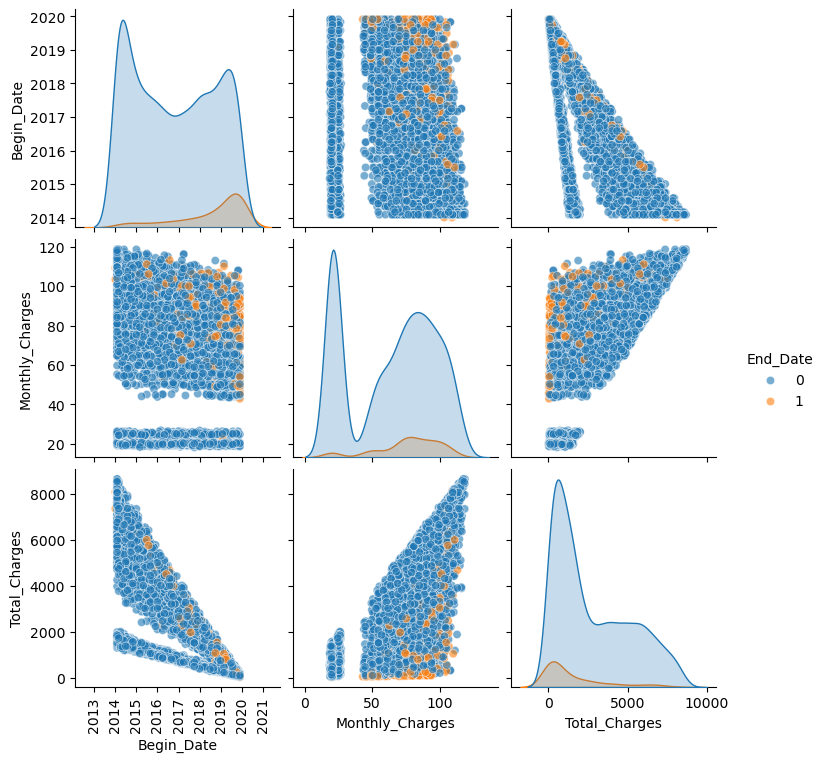
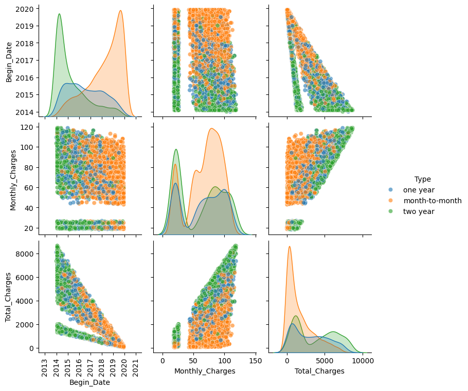
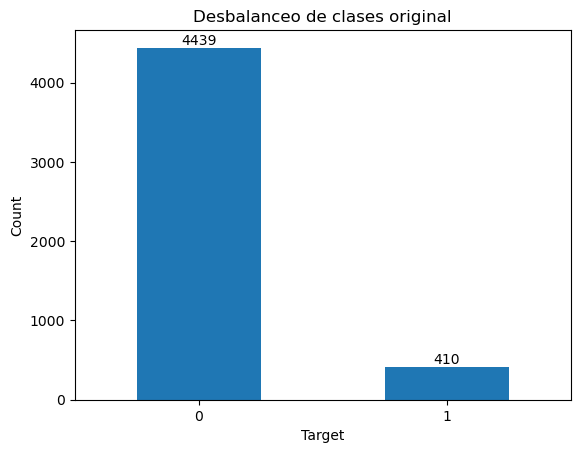
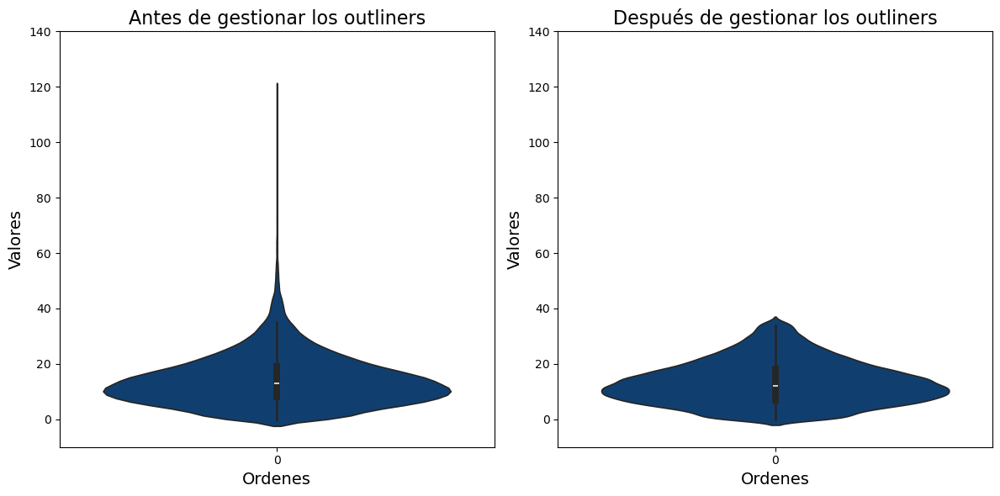

# About Me

Data Analyst with a background in Pharmaceutical Chemistry and Biology, certified in Data Science, with solid, hands-on experience in **data cleaning, exploratory data analysis, dashboard development, SQL querying, and statistical testing**.

I help teams make confident, timely decisions by turning raw, messy data into clear dashboards, reliable reports, and actionable insights — automating repetitive analysis along the way so stakeholders can focus on decisions, not data wrangling.

## Hard Skills
- **Data querying & management:** SQL, PostgreSQL, MySQL, SQL Server, Excel (advanced formulas, pivot tables)
- **Dashboard design & data visualization:** Power BI, Tableau, Seaborn, Matplotlib
- **Data analysis & statistics:** Python (Pandas, NumPy), exploratory data analysis (EDA), hypothesis testing, A/B testing
- **Data pipelines & automation:** ETL processes, Python-based automation
- **Applied machine learning fundamentals:** Scikit-learn, PyTorch — used to support and validate quantitative recommendations

## Soft Skills
| Critical Thinking | Project Management | Process Optimization | Applied Research | Effective Communication | Adaptability | Data Analysis |

## Contact Me

# Table of Contents
- [Data Analysis Projects](#data-analysis-projects)
  - [Healthcare Service Quality Analysis](#healthcare-service-quality-analysis)
  - [Diagnostic Methodology Comparison for Endolymphatic Hydrops](#diagnostic-methodology-comparison-for-endolymphatic-hydrops)
- [Data Science Projects](#data-science-projects)
  - [Customer Retention (Churn Prediction)](#customer-retention-churn-prediction)
  - [Ride-Hailing App Demand Forecasting](#ride-hailing-app-demand-forecasting)

# Data Analysis Projects

## Healthcare Service Quality Analysis

The occupational medicine department of Family Medicine Hospital Unit 21, part of the Mexican Social Security Institute (IMSS), wanted to evaluate the quality of care patients received across the following procedures:

- Work accident assessment
- Partial Permanent Disability ruling
- Disability ruling
- Occupational disease assessment
- Disabled beneficiary ruling
- Total Permanent Disability ruling

The goal was to compare patients' **expectations** against their **perceptions** of the care received.

### Tools
Excel, Python, SQL, PostgreSQL, Power BI, Pandas, Jupyter Notebook.

### Requirements for Success
1. Design and build an interactive dashboard showing:
   - General patient demographics by procedure, with slicers to compare differences in care across procedures.
   - A comparison between expectations and perceptions of the care received.
2. Build a relational database to feed the dashboard going forward.

### Key Questions
**Demographics**
- What is the education level and age of patients by procedure?
- Which procedure is requested most/least often?
- How many patients were seen per procedure?

**Service quality**
- Is expectation or perceived satisfaction higher, overall?
- Which questions showed the largest negative and positive gaps between perception and expectation?
- How do expectation and perception vary by patient sex, per procedure?

**Typical patient**
- What does a typical patient look like for each procedure?

### Methodology
Medical staff surveyed 383 patients using a 22-question survey, applied twice per patient — once before and once after care — following informed consent. Data was collected on-site and delivered as a `.csv` file. Personal identifiers were removed to protect patient confidentiality.

The project followed four stages: **design, development, testing, and analysis.**

### Recommendations
- Prioritize the issues raised in questions 22, 9, and 8, since these consistently ranked among both the largest overall gaps and the largest gaps for the most-requested procedure. Because dissatisfaction was concentrated in specific, well-defined cases, these are the fastest wins for improving both perception and overall satisfaction.
- In the medium term, address questions 2, 12, and 7 to cover all high-priority improvement areas and further close the expectation–perception gap.
- Collect more data for the least-represented procedure (Total Permanent Disability ruling), or consolidate it with Partial Permanent Disability ruling to support more robust future analysis.

### Interesting Visualizations

**How many patients were seen per procedure?**

| Procedure | Number of Patients |
| --- | --- |
| Work accident assessment | 204 |
| Partial Permanent Disability ruling | 51 |
| Disability ruling | 56 |
| Occupational disease assessment | 46 |
| Disabled beneficiary ruling | 25 |
| Total Permanent Disability ruling | 1 |

The Power BI dashboard below reproduces this table dynamically while breaking down each procedure by sex, age range, and education level — adding analytical depth without sacrificing responsiveness.

**How is each sex distributed across procedures?**

Of the 383 patients surveyed, 181 were men and 200 were women. Work accident assessment was by far the most requested procedure, covering more than half of all cases, while Total Permanent Disability ruling was the least requested, with a single case. For Work accident assessment and Disability ruling, the male/female split was fairly balanced (40–60%); for the remaining procedures, the split was markedly uneven.

**Which questions drove the largest expectation–perception gaps?**

Across all procedures, expectations of the service were generally higher than the satisfaction actually reported. Questions 9, 15, 7, 22, and 8 showed the strongest positive results (current strengths), while questions 2, 22, 9, 8, and 7 showed the largest negative gaps (priority improvement areas). For the most-requested procedure alone, questions 9, 22, 8, 2, and 12 stood out as priorities — with 22, 9, and 8 overlapping with the global findings, reinforcing them as the top priorities to address.

**What does a typical patient look like per procedure?**

The dashboard shows how demographics (average age, most frequent sex) and average expectation/perception scores shift by procedure, reflecting differences in each procedure's patient population.

---

## Diagnostic Methodology Comparison for Endolymphatic Hydrops

A statistical comparison of two diagnostic approaches — the Bárány Society's clinical criteria and extratympanic electrocochleography (ECochG) — for diagnosing endolymphatic hydrops, across 38 patients (both ears) at UMAE HE 1's audiology department.

### Hypotheses
- **Null hypothesis:** There is no statistically significant difference between the diagnostic classifications produced by extratympanic ECochG and the Bárány Society's clinical criteria in adult patients seen at UMAE HE 1's audiology department.
- **Alternative hypothesis:** There is a statistically significant difference between the two diagnostic approaches.

### Tools
Excel, Python, Pandas, NumPy, Statsmodels, Jupyter Notebook, Seaborn, Matplotlib, inferential statistics.

### Requirements for Success
1. Statistically determine whether the Bárány criteria and ECochG produce equivalent diagnoses.
2. Calculate the sensitivity and specificity of ECochG relative to the clinical criteria.

### Key Questions
- Are diagnoses from the Bárány criteria and ECochG equivalent, regardless of disease severity?
- What proportion of diagnoses were "definite" versus "probable"?
- What are the sensitivity (recall) and specificity of ECochG compared to the Bárány criteria?

### Methodology
Raw data from a `.csv` file was cleaned and structured in Python using Pandas. Initial relationships between variables were explored using Matplotlib and Seaborn. Feature engineering enriched the dataset ahead of running McNemar's test for each ear in every clinical case. Sensitivity and specificity were calculated and interpreted alongside the test results to reach a final conclusion on diagnostic equivalence.

### Recommendations
Results indicated no statistically significant difference between ECochG and the Bárány clinical criteria for either ear within this patient group — supporting diagnostic equivalence. This finding was used to justify the acquisition of specialized equipment for the audiology department.

### Interesting Visualizations

**Diagnostic outcomes by ear using the Bárány criteria**

- "Definite" was the most frequent diagnosis in both ears; "probable" was the least frequent.
- "Negative" was the second most common outcome for both ears.
- Among "definite" diagnoses, bilateral cases were slightly less common than right-ear-only cases — but the pattern reversed for the left ear, where bilateral cases outnumbered left-ear-only cases. The gap between these proportions was small in both cases.
- Bilateral "probable" diagnoses were markedly less frequent than single-ear "probable" diagnoses, at roughly a 1:3 ratio.

**How reliable is ECochG compared to the traditional method, by ear?**

*Right ear*
- Sensitivity (Recall): 0.88
- Specificity: 0.71
- McNemar's test p-value: 1.0 — no statistically significant evidence to reject the null hypothesis; both methods classify patients similarly for the right ear.

*Left ear*
- Sensitivity (Recall): 0.95
- Specificity: 0.69
- McNemar's test p-value: 0.375 — above the standard significance threshold (α = 0.05); no significant difference found for the left ear either.

# Data Science Projects

## Customer Retention (Churn Prediction)

According to a Harvard Business School study, acquiring a new customer costs 5–7 times more than retaining an existing one. To help **reduce costs**, I built a predictive model that identified customers likely to cancel their Telecom service, enabling **targeted retention campaigns** and improving **customer loyalty**.

### Tools
Python, NumPy, Pandas, Scikit-learn, Seaborn — classification, predictive modeling, supervised learning.

### Requirement for Success
The model needed to achieve an AUC-ROC score above 0.65.

### Key Questions
1. What factors influence service cancellation?
2. What time window should be used for prediction?
3. How should customers be segmented to effectively train a machine learning model?

### Methodology
**Data import:** Combined multiple Telecom `.csv` files into a single dataset.

**Exploratory Data Analysis:** Identified the target variable and features for an imbalanced classification problem spanning three contract lengths (phone and/or internet service), with a 6-year prediction horizon. Consolidated the data, standardized formats, handled missing values, and confirmed there were no duplicate records.

**Preprocessing:** Performed feature engineering (creating and removing columns), encoded categorical variables (one-hot and label encoding), scaled features, split the data, and applied upsampling to address class imbalance.

**Modeling:** Trained logistic regression and random forest classifiers, testing with and without cross-validation, Bayesian hyperparameter optimization, and boosting.

**Final model:** Correctly predicted 72% of test cases, exceeding the client's requirement.

### Recommendations
- **Focus retention efforts:** Customers with both phone and internet service generate the majority of revenue, regardless of contract type.
- **Simplify contract transitions:** Loyal customers typically start on monthly contracts before moving to annual and then biennial plans — making that transition easier could improve retention.

### Interesting Visualizations

**Customer profile**

Customers split into two groups around a spending threshold near 40, most visible when comparing total charges against contract start date. Contract-ending patterns (0/1) appeared across both groups and variable combinations, suggesting these factors alone are unlikely to strongly predict cancellation.

**Effect of contract length**

Most customers currently hold monthly contracts, though loyal customers migrate toward longer terms over time. Biennial contracts account for the largest share of total charges.

**Class imbalance**

The original dataset had a marked ~10:1 class imbalance.

This was addressed with upsampling to produce a balanced training set.

**AUC-ROC curve**

The final model made correct predictions 72% of the time, exceeding the client's requirement.

Explore the full repository: 

---

## Ride-Hailing App Demand Forecasting

By anticipating fluctuations in ride demand near airports, this project enabled better allocation of drivers and operational resources to meet request volume efficiently during peak periods.

### Tools
Python, NumPy, Pandas, Scikit-learn, Seaborn, Statsmodels — time series analysis, supervised learning.

### Requirement for Success
The RMSE metric on the test set could not exceed 48, for a one-hour prediction horizon.

### Key Questions
1. How should outliers be handled?
2. Is the time series stationary?
3. Which model best predicts demand?

### Methodology
**Data import:** Imported a Sweet Lift Taxi `.csv` file with 26,496 rows, including an incorrectly typed `datetime` column.

**Exploratory Data Analysis:** Corrected the `datetime` column type to properly support a time series forecasting model.

**Preprocessing:** Built a custom function to flag outliers versus data following the general pattern, resampled the data to redefine the analysis window, and used a rolling average to convert the series into a stationary one suitable for model training.

**Modeling:** Trained linear regression and random forest regression models, tuning hyperparameters with GridSearchCV and Optuna, and using CatBoost for boosting.

**Final model:** The random forest model achieved an RMSE of 35.65 on the test set for a one-hour prediction horizon — below the required threshold of 48.

### Recommendations
- **Efficient demand management:** Hourly order volume typically fluctuates by about ±20, allowing driver counts to be reserved in advance of peak hours.
- **Efficient resource allocation:** Demand forecasts support dynamic, hour-by-hour fare adjustments to balance driver availability and maximize profitability.

### Interesting Visualizations

**Outlier detection**

A custom function identified and removed numeric outliers outside the range Q1−(IQR×1.5) to Q3+(IQR×1.5). After filtering:
- Mean changed from 14.070 to 13.279
- Standard deviation changed from 9.211 to 7.763
- Minimum remained at 0.000
- Maximum changed from 119 to 35

**Trend and seasonality in the raw data**

The raw series showed a generally upward trend in taxi orders over time, ranging roughly from 35 to 118 orders, with hourly seasonality oscillating between about −50 and 40 orders. The residual component required no further analysis. The original series was non-stationary and unsuitable for direct model training.

**Transformation to a stationary series**

The series was transformed into a stationary one suitable for training a predictive model.

Explore the full repository: 

