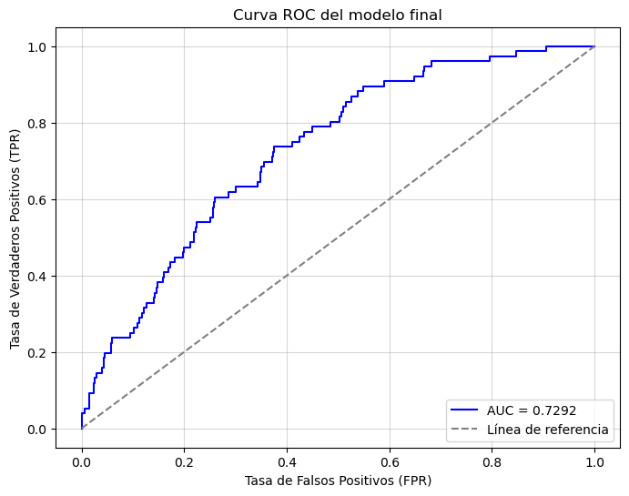

# Acerca de mí

Químico Farmacéutico Biólogo, con maestría en Síntesis Total certificado en Ciencia de Datos con sólida experiencia en limipieza de datos, ingeniería de características, construcción de modelos de aprendizaje automático y su optimización.

Doy certeza en la toma de decisiones estratégicas y ahorro tiempo mediante la automatización usando modelos de aprendizaje automático y pruebas de hipótesis que realizan predicciones confiables.

## Hard Skills
- Generación de modelos predictivos usando __Scikit-learn, PyTorch, TensorFlow__
- Optimización de modelos de __Machine Learning__ con __CatBoost, Optuna, LigthGBM__ y __GridSearchCV__
- Visualización de datos con herramientas como __Seaborn, Matplotlib, PowerBI, Chemdraw__ y __MestreNova__

## Soft Skills
| Pensamiento crítico | Gestión de proyectos | Optimización de procesos | Investigación aplicada | Comunicación efectiva | Adaptabilidad | Química Orgáncia |

## Contáctame

# Proyectos relevantes

## 1. Retención de clientes en la industria de telecomunicaciones

Según un estudio de Harvard Business School, el coste de adquisición de un nuevo cliente es de 5 a 7 veces mayor que el coste de retener un cliente existente. Con la finalidad de __reducir costos__ desarrollé un modelo predictivo que permitió identificar a los clientes que cancelarian su servicio con Telecom, permitiendo desarrollar __estrategias promocionales focalizadas__ aumentando la __fidelización efectiva__.

### Herramientas y habilidades utilizadas

### Requerimiento para el éxito:

El modelo debe de ser capaz de predecir con un AUC-ROC superior a 0.65.

### Preguntas clave

1. ¿Qué factores podrían afectar la cancelación del servicio?
2. ¿Qué ventana de temporal debería de utilizarse para realizar la predicción?
3. ¿Cómo se pueden segmentar los clientes para entrenar efectivamente un modelo de aprendizaje automático?

### Metodología

__Importación de datos__: Se importaron los datos a partir de varios archivos .csv de Telecom con diferentes datos a analizar.

__Exploratory Data Analysis (EDA)__: Se identificó la variable objetivo y las características de cara a un problema de clasificación desbalanceada en una población con tres tipos de duración de contrato que pueden
abarcar los servicios de telefonia y/o internet y se definé un horizonte de predicción de 6 años con base en los datos presentados por el cliente. Se consolida la información necesaria en un solo dataset, y se 
homogenizaron formatos, gestionando valores ausentes y corroborando la duplicación de valores explícitos.

__Preprocesamiento__: Se realizó feature engineering al crear y eliminar columnas, codificación de columnas categóricas utilizando One-Hot Encoding y Codificación de etiquetas, escalamiento, segmentación de datos
y el usó de upsampling.

__Modelos__: Se entrenaron modelos de regresión logística y tipo bosque aleatorio de clasificación, probando métodologías con y sin validación cruzada, con y sin optimización bayesiana de hiperparámetros, y con y 
sin boosting.

__Modelo Final__: El modelo final predijo correctamente el 72% de los casos de prueba superando el requerimiento de cliente.

### Recomendaciones

__Focalizar esfuerzos__: Exiten dos tipos de clientes, sin embargo aquellos clientes que contratan servicios de telefonia e internet aportan la mayor parte del ingreso independientemente del tipo de contrato 
contratado.

__Facilitar la transición de contratos__: Los clientes más fieles en su mayoría comienzan con un contrato mensual, que eventualmente cambian a uno anual y finalmente a una bianual. Facilitar la transición entre  
un tipo de contrato y otro podría aumentar la fidelización.

### Visualizaciones interesantes

1. ¿Cómo son los clientes?

Los clientes constan de dos poblaciones que se separa en un valor de gasto cercano a 40, siendo menor a dicho valor si sólo se contrata uno de los dos servicios disponibles comportamiento apreciado al analizar los cargos totales contra la fecha de incio del contrato. Por otra parte, la distribución de los valores de End_Date, 0 y 1, se observa en ambas poblaciones y en cada relación de variables representada por lo que es poco probable que estos factores mantengan una relación determinante por si mismos para predecir la cancelació o no del servicio.

2. ¿Cómo influye la ventana contractual en los clientes?

Observamos que la mayoría de los clientes actualmente tiene contratos mensuales, sin embargo existe una migración a contratos de mayor duración en los clientes leales. Por otra parte, la mayor parte de los cargos totales se deben a contratos bianuales.

3. Desbalanceo de clases

Los datos iniciales tenían un marcado desbalanceo con una aproximación 10:1.

Dicho desbalanceo se trató con upsampling logrando balancear las clases. Acontinuación se muestra el conjunto de entrenamiento balanceado.

4. Curva AUC-ROC

El modelo final permitió realizar predicciones correctas el 72% de las ocasiones superando el requerimiento del cliente.

Explora a detalle en el repositorio: 

## 2. Predicción de la demanda de una app de transporte 

Previniendo fluctuaciones en la demanda de transporte en áreas adyacentes a aeropuertos, se logró asignar recursos operativos y captar suficientes conductores para cubrir eficientemente el volumen de solicitudes durante los períodos de mayor actividad.

### Herramientas utilizadas

### Requerimientos para el éxito:

La métrica RECM en el conjunto de prueba no debía superar a 48 en un horizonte de una hora.

### Preguntas clave

1. ¿Cómo gestionar los datos atípicos?
2. ¿Se cuenta con una serie temporal estacionaria?
3. ¿Qué modelo puede ser útil para predecir la demanda?

### Metodología

__Importación de datos__: Se importaron los datos a partir de un archivos .csv de Sweer Lift Taxi con 26496 filas y variables tipo _object_ e _intiger_ en los datos y con una asignación de tipo de variable
incorrecta en la columna _datetime_.

__Exploratory Data Analysis (EDA)__: Se modificó el tipo de variable contenida en la columna datetime de acuerdo a la documentación para abordar la construcción de un modelo predictivo para serie temporales. 

__Preprocesamiento__: Se gestionaron outliners mediante una función propia para identificar a los datos que seguian un patrón general y cuales no. Se utilizó el remuestreo redifiniendo la ventana temporal a 
analizar. Usando una media móvil se transformó la serie temporal a una estacionaria apta para entrenar el modelo.

__Modelos__: Se entrenaron modelos de regresión lineal y Bosque aleatorio de regresión utilizando GridSearchCV y Optuna para el _tunning_ de hiperparámetros y CatBoost como herramienta de boosting.

__Modelo Final__: El RMSE del modelo de bosque aleatorio con el conjunto de datos de prueba fue de 35.65 al predecir el número de ordenes de servicio de taxi  en un escenario con horizonte de una hora siendo 
menor al umbral solicitado de 48.

### Recomendaciones

__Gestión eficiente de la demanda__: Los datos mostraron que la demanda habital de ordenes de servicio oscila entre más menos 20 ordenes, de una hora a otra permitiendo reservar el número de conductores necesarios
para cubrir las horas pico de servicio. 

__Gestión eficiente de los recursos__: Las predicciones de la demanda permiten ajustar las tarifas de forma dinámica hora a hora para regular la disponibilidad de conductores de taxi maximizando la rentabilidad.

### Visualizaciones interesantes

1. ¿Cuántos datos siguen un patrón general?

Se creó una función que identificó y eliminó los outliners númericos que exceden el intervalo que va desde Q1-(IQR*1.5) a Q3 +(IQR*1.5).Siendo IQR el espacio intercuartílico, Q1 el percentil 25% y Q3 el percentil
75%. Después de aplicar la función detect_outliner se observó:

* La media cambió de 14.070 a 13.279.
* La desviación estándar cambió de 9.211 a 7.763.
* El valor mínimo se mantuvo en 0.000.
* El valor máximo cambió de 119 a 35.

2. ¿Qué tendencia y estacionalidad tienen los datos originales?

Se observo una tendencia principalmente ascendente en el número de ordenes de taxis conforme transcurren los meses del año oscilando aproximadamente entre 35 y 118 ordenes. La temporalidad mostró una oscilación 
entre -50 y 40 ordenes aproximadamente que se refieren a las ordenes que son solicitadas de forma repetida cada hora. Finalmente, el último gráfico hace referencia a los residuos que son artefactos 
computancionales que no requirieron mayor análisis. Esta serie temporal no es estacionaria por lo que no es apta para el entrenamiento de un modelo predictivo.

 
3. Tranformación a serie temporal estacionaria

Se transformó la serie temporal en una serie estacionaria apta para el entrenamiento de un modelo predictivo.

Explora a detalle en el repositorio:

